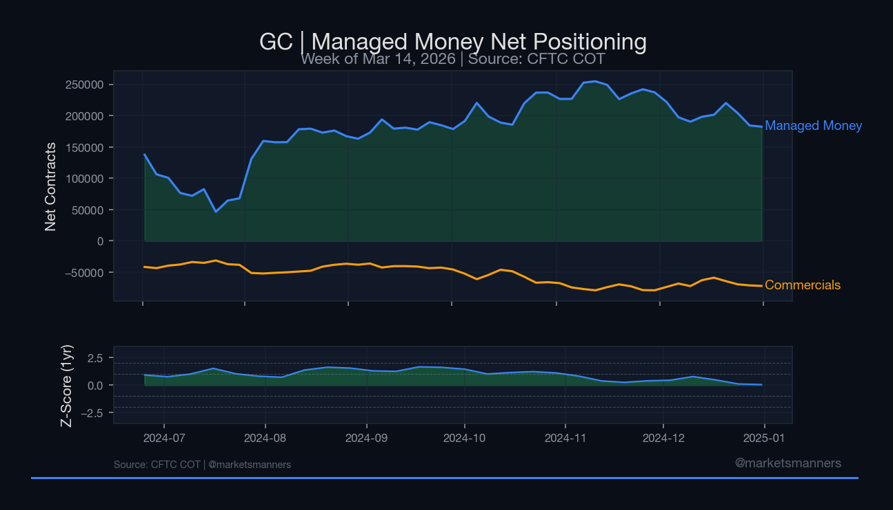
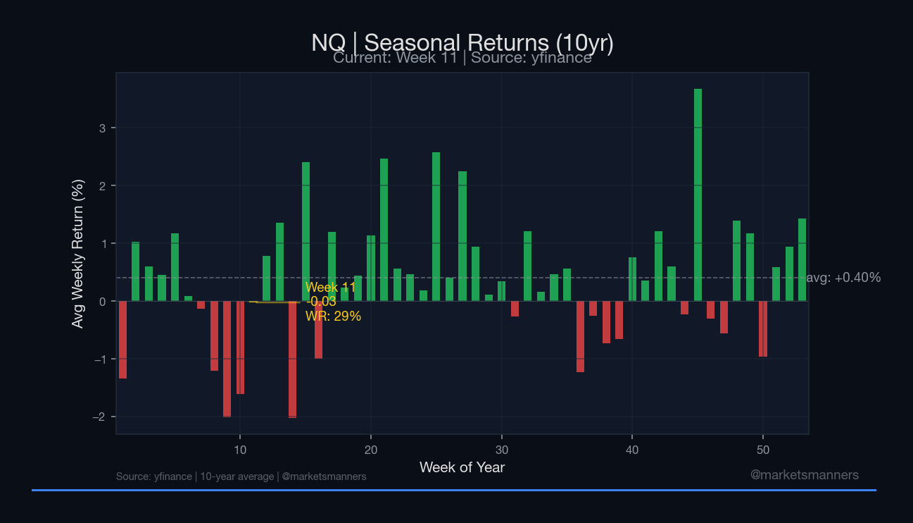
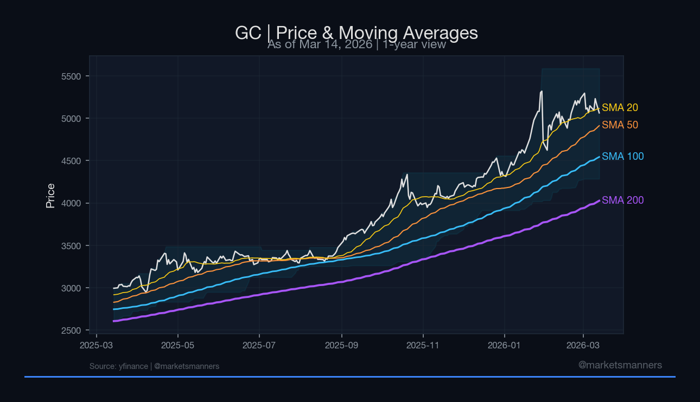

# Financial Analysis Terminal

Automated data pipeline for futures market analysis — COT positioning, price indicators, seasonal patterns, and publication-quality charting.



## Overview

An end-to-end Python pipeline that ingests public market data, computes statistical indicators, and generates branded analytical charts. Built as a portfolio project demonstrating data engineering, statistical computation, and visualization for financial markets.

**What it does:**
- Pulls weekly CFTC Commitment of Traders (COT) positioning data for 4 futures markets
- Fetches daily OHLCV price data via yfinance
- Computes positioning analytics: z-scores (1yr/3yr/5yr), percentile ranks, 26-week index, rate of change
- Computes price indicators: SMAs (20/50/100/200), ATR (14/20-day), Donchian channels (20/50-day)
- Builds seasonal return matrices by week-of-year with win rates and standard deviation
- Generates publication-quality dark-themed charts optimized for social media (1200x675)

## Markets

| Symbol | Market | Report Type | Complex |
|--------|--------|-------------|---------|
| **NQ** | E-mini Nasdaq 100 | TFF | Equity Index |
| **GC** | Gold | Disaggregated | Metals |
| **CL** | WTI Crude Oil | Disaggregated | Energy |
| **ZC** | Corn | Disaggregated | Agriculture |

## Sample Output

### COT Positioning (Managed Money Net + Z-Score)


### Seasonal Returns (Week-of-Year, 10yr Average)


### Price + Moving Averages (with Donchian Channel)


## Architecture

```
src/
├── data/
│   ├── config.py        # Market definitions, CFTC codes, column mappings
│   ├── cot.py           # COT data ingestion + Parquet caching
│   └── prices.py        # Price data ingestion + technical indicators
├── models/
│   ├── positioning.py   # Z-scores, percentile ranks, 26-week index
│   └── seasonal.py      # Week-of-year return analysis
└── viz/
    ├── styles.py        # Color palette, fonts, chart branding
    └── charts.py        # COT, seasonal, and price chart generators

tests/
├── test_cot.py          # 22 tests — COT pipeline for all 4 markets
├── test_prices.py       # 40 tests — price indicators for all 4 markets
└── test_seasonal.py     # 20 tests — seasonal matrix for all 4 markets
```

## Tech Stack

- **Python 3.12** — core language
- **pandas / numpy** — data manipulation and computation
- **matplotlib** — publication-quality chart rendering
- **yfinance** — daily OHLCV price data
- **cot_reports** — CFTC Commitment of Traders data
- **pytest** — 82 tests across all modules
- **Parquet** — two-layer caching (raw + processed)

## Quick Start

```bash
# Clone
git clone https://github.com/katiapek/financial-analysis-terminal.git
cd financial-analysis-terminal

# Set up virtual environment
python -m venv venv
source venv/bin/activate
pip install -r requirements.txt

# Run tests
pytest -v

# Generate charts
python -c "
from src.viz.charts import chart_cot_positioning, chart_seasonal, chart_price_ma
chart_cot_positioning('GC')
chart_seasonal('NQ')
chart_price_ma('GC')
print('Charts saved to output/charts/')
"
```

## Testing

```bash
pytest -v
# 82 tests: COT positioning (22) + price indicators (40) + seasonal analysis (20)
```

## Data Sources

- **CFTC COT Reports** — weekly Commitment of Traders data (Disaggregated + Traders in Financial Futures)
- **Yahoo Finance** — daily OHLCV futures price data

## License

MIT — see [LICENSE](LICENSE)

## Disclaimer

This project is for educational and portfolio purposes only. Nothing produced by this system constitutes investment advice. Trading futures and options involves substantial risk of loss.
